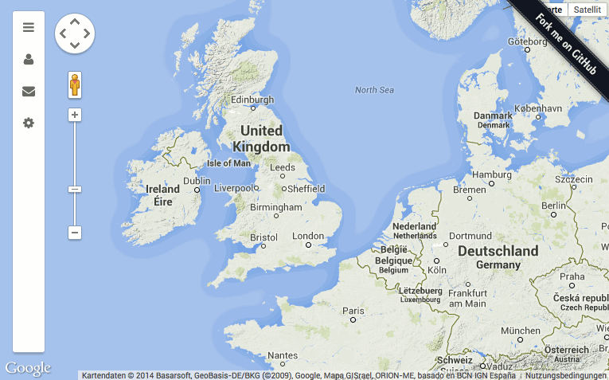
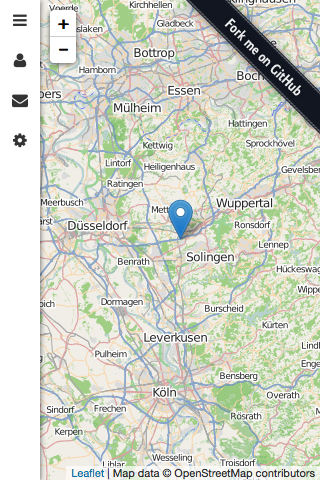
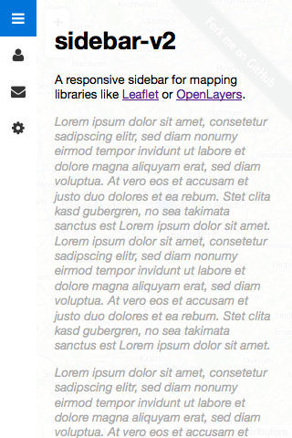
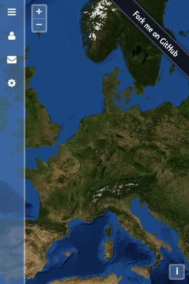
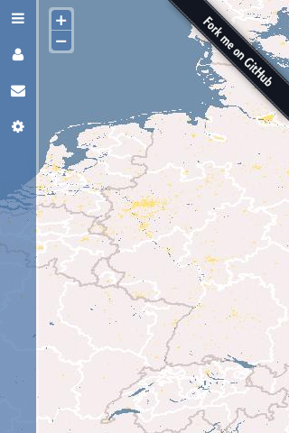
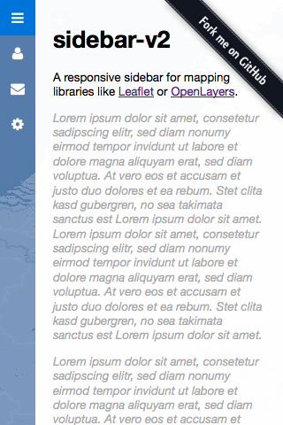
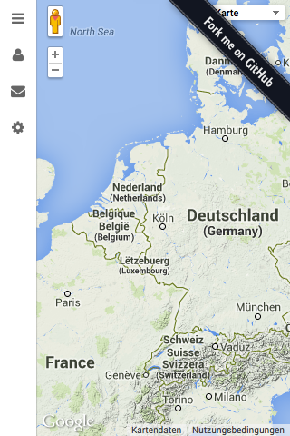
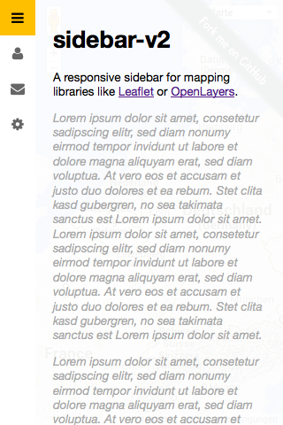

# sidebar-v2

A responsive sidebar for mapping libraries like [Leaflet](#leaflet) or [OpenLayers](#openlayers-3).

It is more or less a successor of the [leaflet-sidebar](https://github.com/turbo87/leaflet-sidebar/) plugin, thus the `v2` suffix.

## [Leaflet](http://leafletjs.com/)

 

Example code at [`examples/index.html`](examples/index.html) ([Preview](http://turbo87.github.io/sidebar-v2/examples/index.html))

## [OpenLayers 3](http://openlayers.org/)

 

Example code at [`examples/ol3.html`](examples/ol3.html) ([Preview](http://turbo87.github.io/sidebar-v2/examples/ol3.html))

## [OpenLayers 2](http://openlayers.org/two/)

 

Example code at [`examples/ol2.html`](examples/ol2.html) ([Preview](http://turbo87.github.io/sidebar-v2/examples/ol2.html))

## [Google Maps](https://developers.google.com/maps/)

 

Example code at [`examples/gmaps.html`](examples/gmaps.html) ([Preview](http://turbo87.github.io/sidebar-v2/examples/gmaps.html))

## License

sidebar-v2 is free software, and may be redistributed under the [MIT license](LICENSE).
